# NorthBridge Ledger Reconciliation & Anomaly Detection Agent

**Status: core engine + multi-ledger proof complete (Phases 1-8) — connects to live Xero and QuickBooks organisations, reconciles, detects anomalies, and explains variance on both.**

A small-scale version of the kind of AI-native ledger automation product accounting firms are increasingly adopting: connects to a live Xero (and QuickBooks Online) organisation via OAuth, reconciles bank transactions against invoices/bills, flags anomalies (duplicates, VAT miscodings, threshold-adjacent amounts, weekend postings, duplicate payments, statistical outliers), and explains period-over-period variance in plain English.

Built against a fictional company ("Northbridge Creative", a UK digital marketing consultancy) seeded with realistic Xero transactions and 7 deliberately planted anomalies, so the detector's accuracy could be honestly measured against a private answer key rather than just claimed. The same engine also runs, unmodified, against a real QuickBooks Online sandbox — proving it's ledger-agnostic, not a Xero-only script.

**Live demo:** https://northbridge-ledger-agent.streamlit.app/ (runs against a frozen snapshot of the seeded data, since the live Xero connection needs local credentials)

## Screenshot

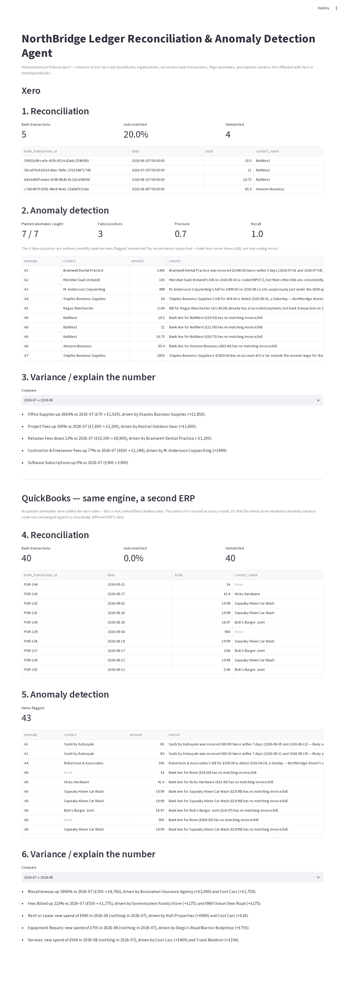

## Evidence

Screenshots from the live Xero trial org and QuickBooks sandbox, showing the anomalies above are real entries in real ledgers, not fabricated for the dashboard.

### Xero

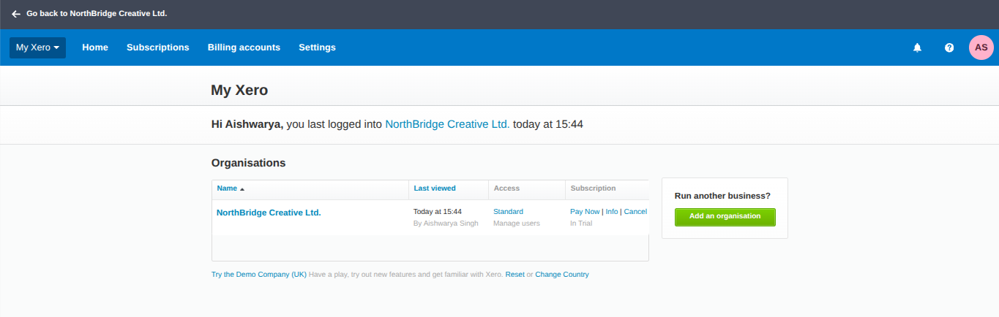
NorthBridge Creative Ltd. — a real Xero trial org ("In Trial"), logged in as the account owner.

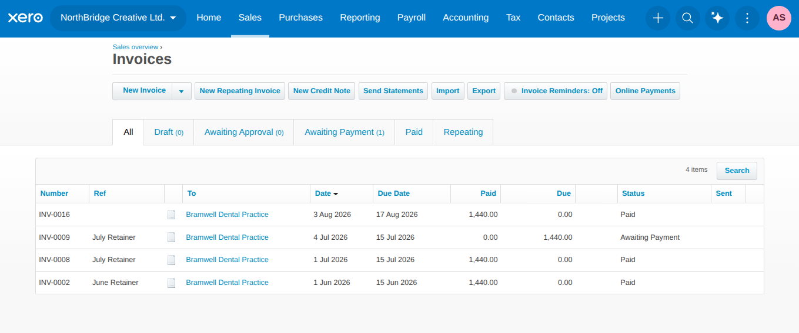
A1 — Bramwell Dental Practice invoiced £1,440 twice: INV-0008 (1 Jul 2026) and INV-0009 (4 Jul 2026), same amount, same retainer.

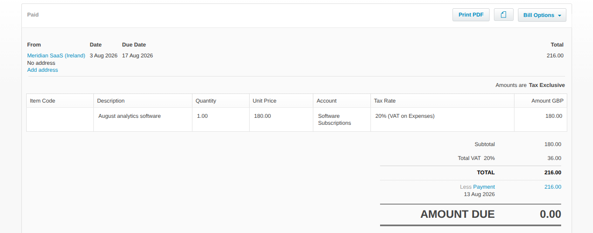
A2 — Meridian SaaS (Ireland) August bill coded with 20% UK VAT, despite Meridian being a foreign supplier.

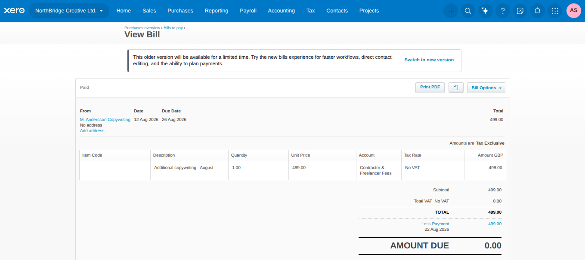
A3 — M. Andersson Copywriting's £499 August bill, just under a round threshold.

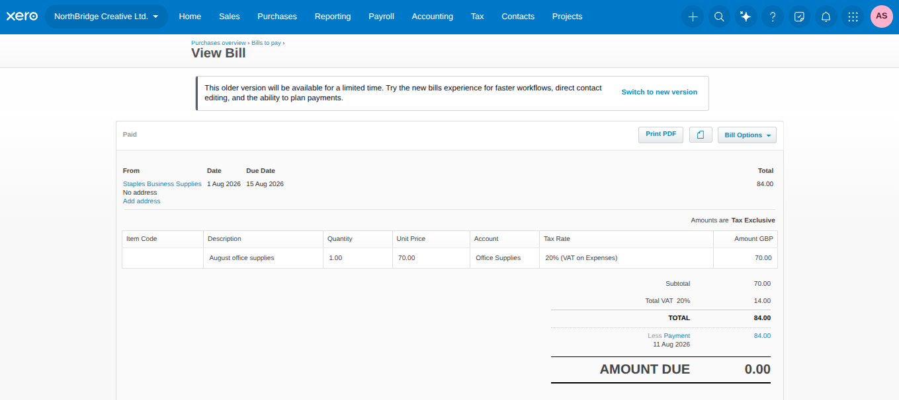
A4 — Staples Business Supplies bill dated Saturday 1 Aug 2026.

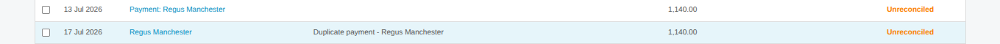
A5 — two £1,140 Regus Manchester payments in the bank feed, both unreconciled, one explicitly labeled "Duplicate payment."

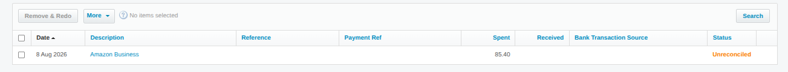
A6 — an £85.40 Amazon Business spend, unreconciled.

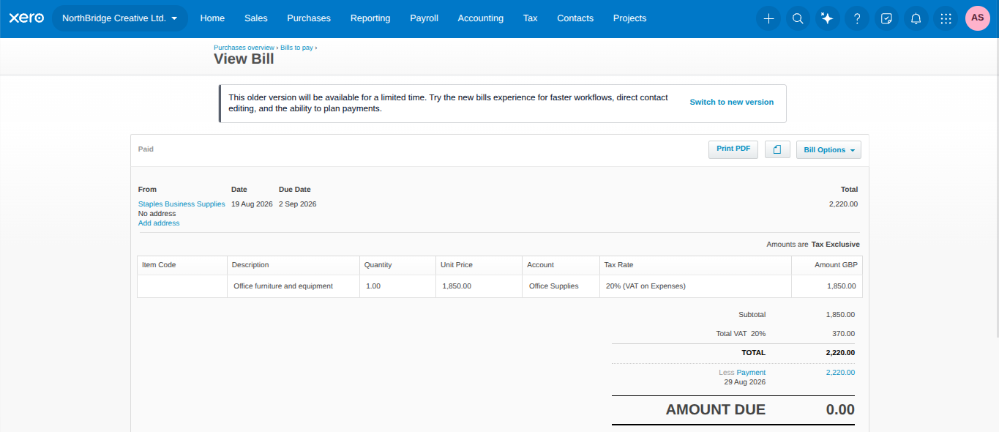
A7 — a £1,850 Staples "office furniture and equipment" bill, well outside the normal spend pattern.

### QuickBooks

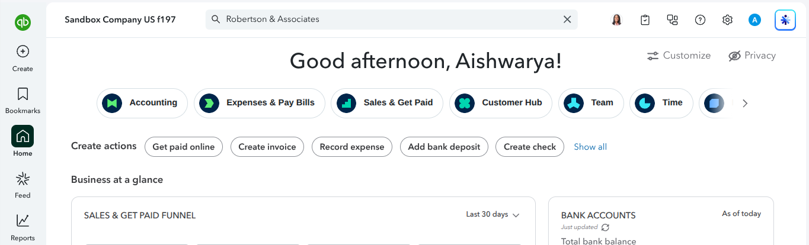
Sandbox Company US f197 — the same company name the connector pulls via the API.

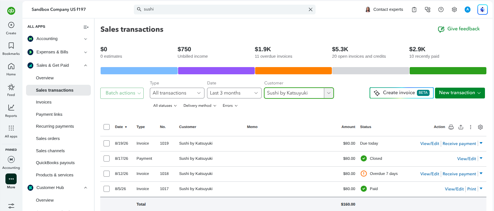
Sushi by Katsuyuki billed $80 three times in August (5th, 12th, 19th) — the suspicious repeating pattern the detector flags.

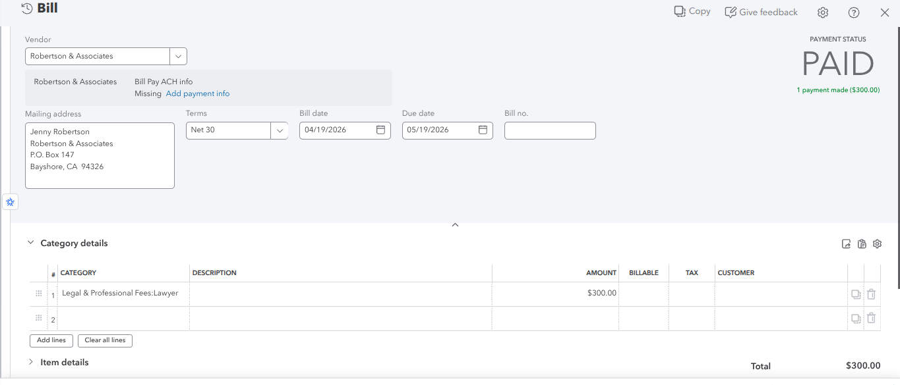
Robertson & Associates bill dated Sunday 19 Apr 2026.

## Architecture

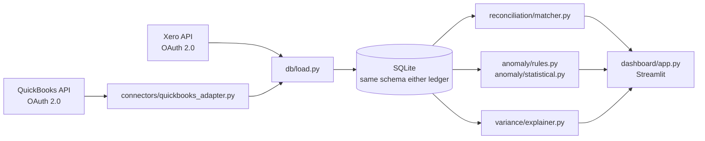

## Setup

```bash
python -m venv venv
source venv/bin/activate
pip install -r requirements.txt
cp .env.example .env   # then fill in your own Xero developer app credentials
```

## Running it

```bash
python -m src.pull_data          # Xero: OAuth + pull + load into data/ledger.db (idempotent)
python -m src.reconcile          # bank-transaction-to-invoice/bill reconciliation report
python -m src.detect_anomalies   # full anomaly detector, scored against the answer key
streamlit run dashboard/app.py   # interactive dashboard: reconciliation + anomalies + variance

# QuickBooks (Phase 8) — same engine, a second ERP
python -m src.pull_data_quickbooks                                    # OAuth + pull + load into data/ledger_quickbooks.db
python -m src.reconcile --db data/ledger_quickbooks.db
python -m src.detect_anomalies --db data/ledger_quickbooks.db --no-score   # no planted-anomaly answer key for this sandbox
```

See `northbridge-ledger-agent-plan.md` for the full phase-by-phase build plan and session log.

## Scale test (synthetic, 5,000 bank transactions)

The live sandboxes are small (Xero: 5 standalone bank lines plus 46 invoice payments; QuickBooks: 40 bank lines plus 26 payments), so the dashboard also has a **synthetic** dataset to show how the engine behaves at scale. `python -m src.seed_synthetic` generates it (seeded, reproducible) into `data/demo_ledger_large.db`, using the same schema as the live pulls, with anomalies A1-A7 planted at known rates (`data/synthetic_planted.csv`).

- Reconciliation plus all anomaly checks over 5,000 bank transactions run in about half a second; the dashboard shows a progress bar for each stage.
- Result on the synthetic set: 84 of 84 planted anomalies caught, 24 false positives (8 monthly bank-fee lines that never have a bill, 16 statistical-outlier flags), precision 0.778.
- **Caveat:** the planted patterns were written to fit the rules, so this demonstrates scale and mechanics, not accuracy on real-world books. The measured accuracy result is the live Xero one below.
- The "Data coverage" table on the dashboard explains why "bank transactions" alone understates activity: Xero and QuickBooks record invoice payments in a separate table from standalone bank lines.
- Xero and QuickBooks pulls now paginate (previously Xero invoices/bills stopped at 100 each and QuickBooks queries at 1,000 rows). Tested against mocked responses only, not re-run against the live APIs.

## Accuracy result

Running the full detector (5 rule-based checks + 1 statistical outlier check + reconciliation's unmatched-item detection) against the seeded dataset and scoring it against the private, deliberately-planted answer key (`data/anomaly_answer_key.csv`, not published in this repo):

**Caught 7 of 7 planted anomalies. 3 false positives. Precision 0.70, recall 1.00.**

The 3 false positives are all ordinary monthly bank-fee lines that reconciliation correctly flags as "unmatched" (bank fees never have a bill behind them) — not real coding errors, but they count against precision since the scoring is intentionally strict. This is the actual, unrounded result — not a claim.

## Multi-ledger proof (QuickBooks)

Phase 8 proves the engine isn't Xero-specific: `src/connectors/quickbooks_adapter.py` normalizes QuickBooks Online's API shapes (which genuinely differ from Xero's — separate Customer/Vendor entities instead of one Contact type, separate Purchase/Deposit entities instead of one BankTransaction type) into the same shape the shared database and engine already expect. The result is that `reconcile.py`, `detect_anomalies.py`, and the dashboard run **unmodified** against a real QuickBooks sandbox via a `--db` flag.

No anomalies were planted in the QuickBooks sandbox (the effort-to-payoff tradeoff of building a second full answer key wasn't worth it for a stretch goal) — instead, the detector found genuine, *unplanted* coincidences in Intuit's own canned demo data: a suspicious-looking duplicate invoice pattern and a bill dated on a Sunday, among others. See the dashboard's "QuickBooks" section for the live result.

## Disclaimer

This is an independent personal project built against a personal Xero trial organisation using only fictional/synthetic data. It is not affiliated with, endorsed by, or connected to Xero or Intuit/QuickBooks.
