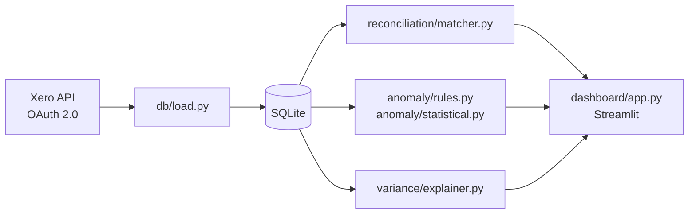

# NorthBridge Ledger Reconciliation & Anomaly Detection Agent

**Status: core engine complete (Phases 1-6) — connects to a live Xero org, reconciles, detects anomalies, and explains variance.**

A small-scale version of the kind of AI-native ledger automation product accounting firms are increasingly adopting: connects to a live Xero organisation via OAuth, reconciles bank transactions against invoices/bills, flags anomalies (duplicates, VAT miscodings, threshold-adjacent amounts, weekend postings, duplicate payments, statistical outliers), and explains period-over-period variance in plain English.

Built against a fictional company ("Northbridge Creative", a UK digital marketing consultancy) seeded with realistic transactions and 7 deliberately planted anomalies, so the detector's accuracy could be honestly measured against a private answer key rather than just claimed.

## Screenshot


## Architecture



## Setup

```bash
python -m venv venv
source venv/bin/activate
pip install -r requirements.txt
cp .env.example .env   # then fill in your own Xero developer app credentials
```

## Running it

```bash
python -m src.pull_data          # OAuth + pull Xero data + load into data/ledger.db (idempotent)
python -m src.reconcile          # bank-transaction-to-invoice/bill reconciliation report
python -m src.detect_anomalies   # full anomaly detector, scored against the answer key
streamlit run dashboard/app.py   # interactive dashboard: reconciliation + anomalies + variance
```

See `northbridge-ledger-agent-plan.md` for the full phase-by-phase build plan and session log.

## Accuracy result

Running the full detector (5 rule-based checks + 1 statistical outlier check + reconciliation's unmatched-item detection) against the seeded dataset and scoring it against the private, deliberately-planted answer key (`data/anomaly_answer_key.csv`, not published in this repo):

**Caught 7 of 7 planted anomalies. 3 false positives. Precision 0.70, recall 1.00.**

The 3 false positives are all ordinary monthly bank-fee lines that reconciliation correctly flags as "unmatched" (bank fees never have a bill behind them) — not real coding errors, but they count against precision since the scoring is intentionally strict. This is the actual, unrounded result — not a claim.

## Disclaimer

This is an independent personal project built against a personal Xero trial organisation using only fictional/synthetic data. It is not affiliated with, endorsed by, or connected to Xero or Intuit/QuickBooks.
